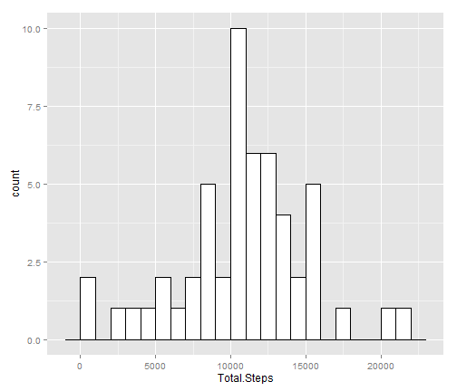
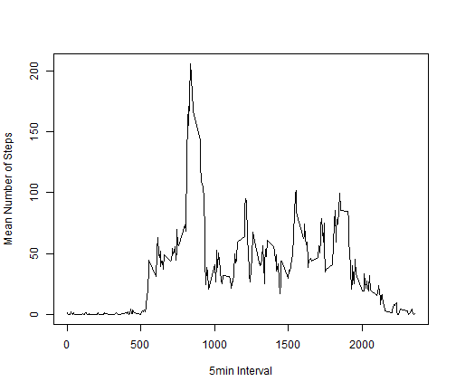
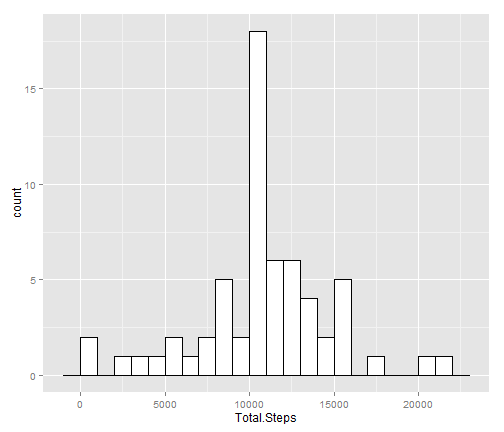
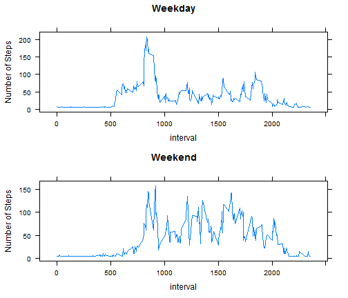

Reproducible Research, Peer Assessment 1
========================================================
## Importing & Processing Data

```r
# Import data
activity <- read.csv("activity.csv")
# Aggregate by date
dailySteps <- aggregate(activity$steps, list(as.Date(activity$date)), sum)
# Name usefully
names(dailySteps) <- c("Date", "Total.Steps")
# Converts to numeric
dailySteps$Total.Steps <- as.numeric(dailySteps$Total.Steps)
```


## What is the mean total number of steps taken per day?
1. The daily totals are distributed like so:

    
    ```r
    library(ggplot2)
    ggplot(dailySteps, aes(x = Total.Steps)) + geom_histogram(binwidth = 1000, colour = "black", 
        fill = "white")
    ```
    
     


    
    ```r
    # Calculate mean
    dailyMean <- mean(dailySteps$Total.Steps, na.rm = TRUE)
    # Calculate median
    dailyMedian <- median(dailySteps$Total.Steps, na.rm = TRUE)
    ```


2. The mean daily number of steps is 1.0766 &times; 10<sup>4</sup>; the median daily number of steps is 1.0765 &times; 10<sup>4</sup>.

## What is the average daily activity pattern?
    
1. The mean number of steps across all days, by five-minute interval:
    
    ```r
    intervalPattern <- aggregate(activity$steps, list(activity$interval), mean, 
        na.rm = TRUE)
    names(intervalPattern) <- c("5min.Interval", "Average.Num.Steps")
    ```


    
    ```r
    plot(intervalPattern, type = "l", ylab = "Mean Number of Steps", xlab = "5min Interval")
    ```
    
     

2. The 5-minute interval with the greatest average number of steps is 835.

## Missing Values
1. The total number of missing values in this dataset is 2304.

2. Missing values will be replaced with the overall mean.

3. This code replaces NAs with the overall mean.

    
    ```r
    for (i in which(sapply(activity, is.numeric))) {
        activity[is.na(activity[, i]), i] <- mean(activity[, i], na.rm = TRUE)
    }
    ```


4. The new daily totals are distributed like so:

    
    ```r
    # Aggregate by date
    dailySteps <- aggregate(activity$steps, list(as.Date(activity$date)), sum)
    # Name usefully
    names(dailySteps) <- c("Date", "Total.Steps")
    # Converts to numeric
    dailySteps$Total.Steps <- as.numeric(dailySteps$Total.Steps)
    ```


    
    ```r
    ggplot(dailySteps, aes(x = Total.Steps)) + geom_histogram(binwidth = 1000, colour = "black", 
        fill = "white")
    ```
    
     


    
    ```r
    # Calculate mean
    dailyAdjMean <- mean(dailySteps$Total.Steps, na.rm = TRUE)
    # Calculate median
    dailyAdjMedian <- median(dailySteps$Total.Steps, na.rm = TRUE)
    ```


The new mean daily number of steps is 1.0766 &times; 10<sup>4</sup>, compared to the original 1.0766 &times; 10<sup>4</sup>; the new median daily number of steps is 1.0766 &times; 10<sup>4</sup>, compared to the original 1.0765 &times; 10<sup>4</sup>.  Replacing missing values with the overall mean distorts the distribution of the data, but since the original mean/median were calculated leaving out the NAs, does not materially change the estimate of central tendency.

## Are there differences in activity patterns between weekdays and weekends?
1. The factor daytype has been added to the data as below.

    
    ```r
    activity$daytype <- factor(ifelse(as.POSIXlt(activity$date)$wday%%6 == 0, "Weekend", 
        "Weekday"))
    ```


2. The time series panel plot of average number of steps taken per 5 min interval per day type

    
    ```r
    library(reshape2)
    test <- melt(activity, c("interval", "daytype"))
    test <- test[1:17568, ]
    test$value <- as.numeric(test$value)
    dayIntervalPattern <- dcast(test, interval ~ daytype, mean)
    ```


    
    ```r
    library(lattice)
    px1 = xyplot(Weekday ~ interval, dayIntervalPattern, type = "l", ylab = "Number of Steps", 
        main = "Weekday")
    px2 = xyplot(Weekend ~ interval, dayIntervalPattern, type = "l", ylab = "Number of Steps", 
        main = "Weekend")
    
    # arrange the two plots vertically
    print(px1, position = c(0, 0.5, 1, 1), more = TRUE)
    print(px2, position = c(0, 0, 1, 0.5))
    ```
    
     
